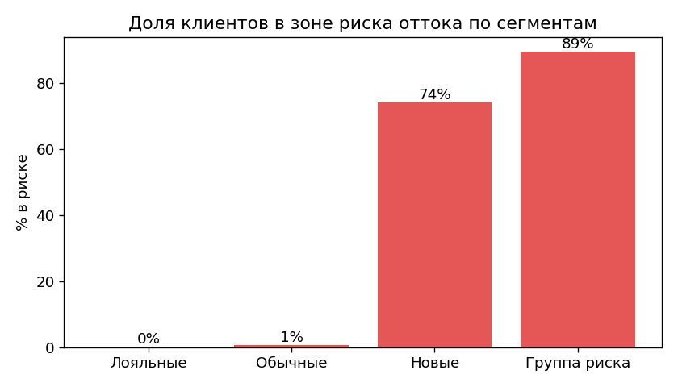
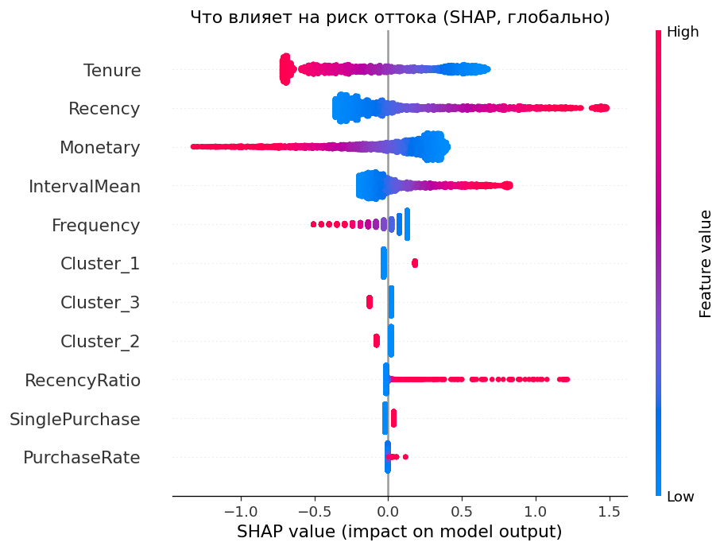
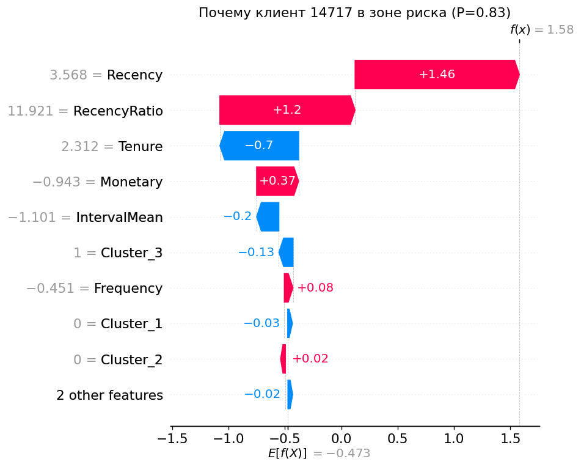

# Сегментация клиентов и предсказание оттока

ML-пайплайн для интернет-магазина, решающий две связанные бизнес-задачи на данных транзакций: **сегментацию клиентов** (unsupervised) и **предсказание оттока** (supervised). От сырых данных — через обоснованную очистку, feature engineering и честное сравнение моделей — до интерпретируемой модели и интерактивного демо.

> **Главная особенность проекта — не метрика, а методология.** Здесь показан полный цикл рассуждений ML-инженера: обнаружение и устранение утечки целевой переменной, строгое сравнение моделей, проверка гипотез с честными негативными результатами и вывод о том, чем реально ограничено качество.

---

## Задача

**Данные:** [Online Retail II](https://archive.ics.uci.edu/dataset/502/online+retail+ii) (UCI) — ~525 тыс. транзакций британского интернет-магазина за 2009–2010 гг. Только чеки: товар, количество, цена, дата, клиент. Никаких внешних сигналов (поддержка, веб-активность) — важное ограничение, к нему вернёмся.

**Две задачи:**
1. **Сегментация** — разбить клиентов на группы по поведению (RFM), без разметки. `KMeans`.
2. **Предсказание оттока** — для каждого клиента оценить вероятность ухода. Целевой переменной в данных нет — её нужно **сконструировать корректно**, что и стало центральной инженерной задачей.

Сегмент из задачи 1 используется как признак в задаче 2 — задачи связаны, а не существуют отдельно.

---

## Ключевые результаты

| | |
|---|---|
| **Сегменты** | 4 интерпретируемых кластера (Лояльные / Обычные / Новые / Группа риска) |
| **Финальная модель оттока** | LogisticRegression, ROC-AUC **0.69** на честном временном сплите |
| **Рабочий порог** | 0.42 под бизнес-цель Recall ≥ 0.75 (ловим 74% уходящих) |
| **Главный вывод** | задача **data-bound**: потолок ~0.69 задают сами данные, а не модель |

**Что делает результат ценным:**
- **Утечка целевой переменной найдена и устранена** через временной сплит. Наивное `churn = Recency > 86` даёт «идеальные» метрики и бесполезную модель — в проекте это разобрано как антипример.
- **Сложная модель честно проверена и отклонена.** CatBoost (из коробки → early stopping → grid search) не побил простой логрег — все модели уперлись в ~0.69. Выбор простой модели по бритве Оккама, а не «взял CatBoost, потому что модно».
- **Гипотезы проверены с негативными результатами.** Поведенческие признаки (тренд, ритм покупок) не подняли качество; признак «кластер» не помогает предсказанию. Оба вывода задокументированы — потолок задают данные, а не число признаков или сложность модели.

---

## Демо (Streamlit)

Веб-приложение: загружаешь CSV с транзакциями → получаешь сегмент, вероятность оттока и **SHAP-разбор факторов риска** по каждому клиенту.

**Риск оттока по сегментам** — модель осмысленно ранжирует: лояльные почти не уходят, «группа риска» — почти вся в зоне риска:



**Что влияет на отток (SHAP, глобально)** — главный фактор `Recency` (давно молчит → риск), `Monetary` и `Tenure` защищают (ценные и давние клиенты уходят реже):



**Объяснение конкретного клиента** — для карточки клиента в демо раскладываем его риск по факторам:



Запуск:
```bash
streamlit run app/app.py
```
> ⚠️ Локальный сервер streamlit требует рабочего WebSocket; на некоторых конфигурациях Windows/Python он не поднимается. Надёжнее всего смотреть демо через деплой на [Streamlit Cloud](https://streamlit.io/cloud) (Linux-окружение).

---

## Пайплайн

| Этап | Ноутбук / файл | Суть |
|---|---|---|
| 1. EDA | `notebooks/01_eda.ipynb` | Разбор проблем данных (пропуски, возвраты, нулевые цены), обоснование очистки |
| 2. Очистка + RFM | `notebooks/02_rfm.ipynb` | 525 461 → 417 503 строк; RFM на 4283 клиента |
| 3. Кластеризация | `notebooks/03_clustering.ipynb` | Нормализация → выбор K → удаление выбросов (IQR) → 4 сегмента |
| 4. Feature engineering | `notebooks/04_features.ipynb` | **Временной сплит** (устранение утечки) + поведенческие признаки |
| 5. Бейзлайн | `notebooks/05_baseline_model.ipynb` | LogisticRegression + подбор порога под Recall |
| 6. Основная модель | `notebooks/06_main_model.ipynb` | CatBoost: из коробки → early stopping → grid; сравнение → data-bound |
| 7. Интерпретация | `notebooks/07_interpretation.ipynb` | SHAP (глобально + локально), проверка гипотезы про кластер |
| 8. Демо | `app/app.py`, `src/scoring.py` | Streamlit: сырые транзакции → сегмент + отток + SHAP |

Переиспользуемая логика вынесена в `src/`: `features.py` (RFM + поведенческие признаки), `evaluation.py` (метрики), `scoring.py` (полный пайплайн скоринга).

---

## Методология: что сделано правильно

**Устранение утечки через временной сплит.** Целевой переменной оттока в данных нет. Наивное правило `churn = Recency > 86` делает метку функцией признака → модель списывает ответ. Правильно: режем период датой **T = max(дата) − 90 дней**; признаки считаем по данным **до T**, факт оттока — по покупкам **после T**. Метка и признаки из разных периодов → утечки нет. Проверено: диапазоны Recency у обоих классов полностью перекрываются (признак информативен, но не детерминирует ответ).

**Дисциплина препроцессинга.** `scaler`/`KMeans`/границы выбросов обучаются один раз и **применяются** (`transform`/`predict`), а не переобучаются на новых срезах — как и порог, который выбирается по train, а не по test. Всё сохранено в `models/` и переиспользуется на этапах 5–8.

**Честное сравнение моделей.** Одна и та же тестовая выборка, одни метрики (ROC-AUC / Precision / Recall / F1 — не accuracy, классы несбалансированы). CatBoost проверен тремя способами и отклонён по цифрам.

**Подбор порога под бизнес.** Для оттока пропуск ушедшего дороже ложной тревоги → порог снижен с 0.5 до ~0.42 через precision-recall curve: Recall 0.59 → **0.74** ценой небольшой просадки Precision.

---

## Сегменты клиентов

| Сегмент | Recency | Frequency | Monetary | Профиль |
|---|---|---|---|---|
| **Лояльные** | низкий | высокий (~8.5) | высокий (~2460) | самые ценные, активные и регулярные |
| **Обычные** | средний | средний (~5) | средний (~1280) | стабильные, между лояльными и новыми |
| **Новые** | низкий | низкий (~2) | низкий (~410) | недавняя активность, мало покупок |
| **Группа риска** | очень высокий (~210) | низкий | низкий | давно не покупали, исторически малоактивны |

---

## Метрики (финальная модель, test)

| Метрика | Порог 0.5 | Порог 0.42 (под Recall) |
|---|---|---|
| ROC-AUC | 0.691 | 0.691 *(не зависит от порога)* |
| Precision | 0.590 | 0.557 |
| Recall | 0.590 | **0.738** |
| F1 | 0.590 | 0.635 |

Все модели (логрег и все версии CatBoost) — в коридоре **0.686–0.696** ROC-AUC. Разброс в пределах шума.

---

## Главный вывод и ограничения

**Задача data-bound.** Ни более сложная модель (CatBoost), ни расширение признаков (поведенческие фичи) не сдвинули потолок ~0.69. Причина: все признаки выведены из одного источника — дат и сумм покупок — и несут одну и ту же информацию. Для behavioral churn на одних транзакциях 0.69 ROC-AUC — нормальный, честный результат.

**Как пробить потолок:** только **внешними данными** — обращения в поддержку, веб-активность, вовлечённость (открытие писем, брошенные корзины), демография. В датасете их нет. Это ограничение данных, а не проекта, и оно строго диагностировано, а не замолчано.

---

## Стек

`Python 3.13` · `pandas` · `scikit-learn` · `CatBoost` · `SHAP` · `Streamlit` · `matplotlib` / `seaborn`

## Структура

```
├── notebooks/        # этапы 1–7 (EDA → интерпретация)
├── src/              # features.py, evaluation.py, scoring.py
├── app/              # app.py (Streamlit) + screenshots/
├── data/processed/   # промежуточные таблицы
├── models/           # сохранённые артефакты (scaler, kmeans, модель оттока)
└── PROGRESS.md       # детальный журнал по каждому этапу
```

## Запуск

```bash
# окружение (conda), Python 3.13
conda create -n ml_prime python=3.13
conda activate ml_prime
pip install -r requirements.txt

# ноутбуки — по порядку 01 → 07 (создают data/processed/ и models/)
# демо
streamlit run app/app.py
```
> Сырые данные (`data/raw/`) и обученные модели (`models/*.pkl`) в `.gitignore` — регенерируются запуском ноутбуков по порядку.
